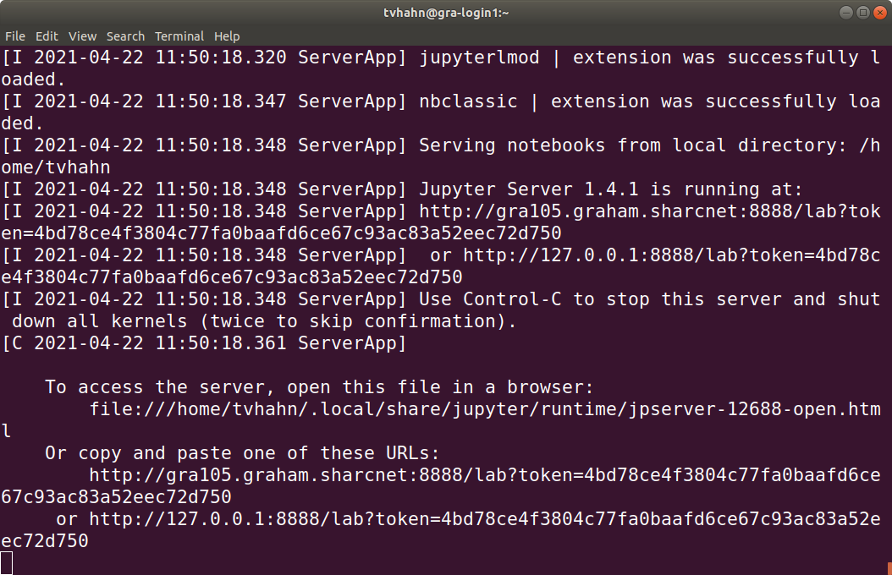

# Running a Jupyter Notebook on Compute Canada

In this tutorial we will learn how to get a Jupyter Notebook running on your local computer, *but* use Compute Canada to power the backend. Why do this? Well, you may have a large data set that requires significant amounts of RAM, storage, or processing power. You may also have a crappy computer...

The tutorial is based on:

- Compute Canada wiki page on Jupyter Notebook ([here](https://docs.computecanada.ca/wiki/JupyterNotebook))
- Youtube video from Sharcnet

## Prerequisites

- `Windows` - Make sure you have a terminal client, like [MobaXterm](https://mobaxterm.mobatek.net/download-home-edition.html) installed on your computer. If you are running Linux or MacOS, a terminal client is installed by default.

## Steps

1. **Login to Compute Canada** 

   Open your terminal client and login with your Compute Canada username.

   * Login: `ssh -Y <your-username>@graham.computecanada.ca`

   * Enter your password at the prompt.

   * You should now be logged in!

     
   > :memo: **Note:** The Compute Canada (CC) HPC is run in a UNIX (Linux) environment. You interact with it using typed commands. CC has a useful Wiki introducing Linux ([here](https://docs.computecanada.ca/wiki/Linux_introduction)). There are also many good resources online, like this [command cheatsheat (pdf) from fosswire](https://files.fosswire.com/2007/08/fwunixref.pdf).

2. **Create and activate a virtual environment**

   Create a virtual environment that contains all the requisite Python applications to get a Jupyter Notebook up-and-running. The `virtualenv` tool allows you to easily install, and manage, Python packages.

   - Go to your home directory. The `cd` command takes you to your home directory.
   - Load the SciPy stack module: `module load scipy-stack/2020b`
     - The `scipy-stack` module includes commonly used scientific computing and data science libraries in a one-stop-shop, like Numpy, Pandas, SciPy. You can read more about modules and how to use them on the CC [wiki page on the topic](https://docs.computecanada.ca/wiki/Utiliser_des_modules/en).
     - Use the `module list` command to see which modules you currently have loaded in your environment.
   - Create the virtual environment in your home directory: `virtualenv ~/jupyter1` 
     - From now on, the`jupyter1` virtual environment will depend on loading the `scipy-stack/2020b` module first.
   - Activate the virtual environment you just created: `source ~/jupyter1/bin/activate`
     - "bin" folders, in Linux, contain ready to run  programs
     - To deactivate a virtual environment, use the command `deactivate`

3. **Install the python packages**

   Install the packages we need to open up a Jupyter notebook and do data analysis.
   
   * Install [scikit-learn](https://scikit-learn.org/stable/index.html): `pip install --no-index sklearn`
     
     :warning: Make sure you have the module `scipy-stack/2020b` loaded (via `module load scipy-stack/2020b` )
     
        > :memo: **Note:** Compute Canada has many common python packages already compiled (made into "wheels") on their system (see available [python wheels](https://docs.computecanada.ca/wiki/Available_Python_wheels)). These are installed with pip using the `--no-index` command. Installing the wheels from CC can save considerable time, and not overload the login node.
     
   * Install Jupyter Lab, which we'll use to run notebooks: `pip install --no-index jupyterlab`
   
4. **Create a script to launch Jupyter Lab** 

   Use nano to create a bash script that we'll call upon to open up a Jupyter Lab session.

   * Create a script in your virtual environment, in the bin folder: `nano $VIRTUAL_ENV/bin/notebook.sh`

   * This opens up the nano text editor, so that we can create the bash script (see the [Youtube video](https://youtu.be/5yCUDqAbBUk?t=969) for more details):

       ```bash
       #!/bin/bash
       unset XDG_RUNTIME_DIR
       jupyter-lab --ip $(hostname -f) --no-browser
       ```

       Press ctrl-O to save, ctrl-X to exit. 

   * Back in your home directory, change the user privileges of the `notebook.sh` that you just created (we'll allow the user, *u*, to execute, *x*, the file). This is needed so that we can run the script in the bin folder: `chmod u+x $VIRTUAL_ENV/bin/notebook.sh `
   * Now install the Lmod: `pip install --no-index jupyterlmod`

5. **Create an allocation to run Jupyter Lab**

   * ```
     salloc --time=1:0:0 --ntasks=1 --cpus-per-task=2 --mem-per-cpu=1024M --account=def-profaccount srun $VIRTUAL_ENV/bin/notebook.sh
     ```
     
     * Allocate 1 hour for 1 task, using 2 cpus and 1024 MB of RAM/CPU. Allocated on the
     
      :warning:Try not to allocate more than you need so that the resources can be efficiently used between users.
     
   * When you have the allocation, you should see something like this:
   
     
   
6. **SSH tunnel from your local computer into the Jupyter Notebook**

   The Jupyter Notebook is now running on the Compute Canada HPC. We need to "tunnel" into the HPC system and show the notebook on our local computer.

   * Open a new terminal window.

   * In the new terminal, ssh into the graham server. Type something like this, based on what is shown the other terminal you have open showing the notebook access token:

     ``` 
     ssh -L 8888:gra105.graham.sharcnet:8888 tvhahn@graham.computecanada.ca
     ```
     * The local port is 8888. The local host will be port forwarding the 8888 port to the gra105.sharcnet:8888 port.

   * It will ask you for your login credentials. Fill that in.

   * Then on local browser, put link to jupyter lab with access token, like: `http://localhost:8888/?token=<token>`. Or, you can copy the link from your terminal (or click it if your terminal client allows you to).

   

> :memo: **Note:** 

